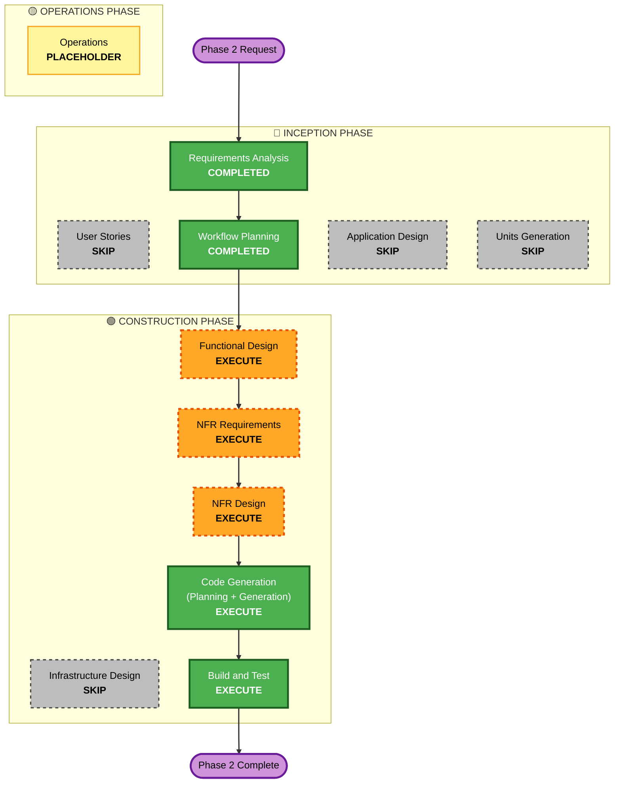

# Execution Plan — Phase 2: Custom Photo Puzzles

Covers only Phase 2 (one phase at a time). Builds on the completed Phase-1
architecture, persistence, and adjacent-swap engine.

## Detailed Analysis Summary

### Transformation Scope (Brownfield)
- **Type**: Feature addition (new subsystem) on existing layered architecture.
  No cloud/infrastructure.
- **Primary changes**:
  - Add **CameraX** capture + **PickVisualMedia** photo-picker entry.
  - Add **image processing** (downsample ~1024px, center-crop, thumbnail, slice)
    for user-supplied URIs.
  - Wire **create flow** (chooser → capture/pick → review → pick size →
    generating → board) and **save** (custom PuzzleRecord + files).
  - Add **My puzzles library** (grid, play, delete-with-confirm, empty state).
  - Add **CAMERA permission** handling (rationale, denied, permanently-denied
    screen with Settings + picker fallback, no-camera fallback).
  - Auto-naming for custom puzzles.

### Change Impact Assessment
- **User-facing**: Yes — new create/library/permission screens; Home CTA becomes
  functional.
- **Structural**: Additive — new `camera/`, `image/` (enhanced), `ui/screens`
  create+library; reuse `data`/`domain`/`di`.
- **Data model**: Reuses existing schema (`ImageRef.FileRef`, custom
  PuzzleRecord); no migration needed.
- **API**: Internal only; adds `addCustomPuzzle` usage (already in repo),
  image-processing use-case.
- **NFR**: Memory-safety (OOM), CAMERA permission, security (input validation,
  no PII logging), resiliency (decode/capture failure).

### Component Relationships (Brownfield)
- **New**: `camera/CameraController` (CameraX), `image/PhotoImporter`
  (URI→processed files+tiles), `ui/screens/{Chooser,Camera,Review,GeneratingImport,
  MyPuzzles,PermissionNeeded}`, `presentation/CreateViewModel`.
- **Reused**: `PuzzleRepository.addCustomPuzzle/deletePuzzle`, `PuzzleFileStore`,
  `ImageSlicer`, `GameViewModel`, Hilt modules, adjacent-swap engine.

### Risk Assessment
- **Risk**: Medium-High — device permissions + camera lifecycle + bitmap memory
  are the classic Android footguns; mitigated by CameraX, downsampling, and
  off-main-thread processing.
- **Rollback**: Easy (git, additive).
- **Testing**: Moderate — pure image-math PBT is JVM-testable; camera/permission
  need device/manual.

## Workflow Visualization

## Phases to Execute

### 🔵 INCEPTION PHASE
- [x] Requirements Analysis (COMPLETED)
- [x] User Stories (SKIPPED — flows well-specified; user declined)
- [x] Workflow Planning (IN PROGRESS)
- [ ] Application Design — **SKIP**
  - **Rationale**: New pieces (CameraController, PhotoImporter) are cohesive
    single-responsibility components whose contracts are fully captured by
    Functional Design; they slot into the existing layer boundaries. No complex
    multi-service design needed.
- [ ] Units Generation — **SKIP**
  - **Rationale**: One cohesive unit of work; no parallel decomposition.

### 🟢 CONSTRUCTION PHASE
- [ ] Functional Design — **EXECUTE**
  - **Rationale**: New business logic — image-processing pipeline (sample-size
    math, center-crop, thumbnail), create/save flow, auto-naming, permission
    state machine. Mandatory PBT-01 property identification for the pure
    image-math.
- [ ] NFR Requirements — **EXECUTE**
  - **Rationale**: Tech-stack (CameraX version), memory/OOM budgets, CAMERA
    permission, security (input validation, no PII logging).
- [ ] NFR Design — **EXECUTE**
  - **Rationale**: Memory-safe decode pattern (inSampleSize/BitmapFactory
    bounds), camera lifecycle binding, permission-denial flow, fail-safe error
    handling.
- [ ] Infrastructure Design — **SKIP** (offline on-device; no cloud).
- [ ] Code Generation — **EXECUTE (ALWAYS)**.
- [ ] Build and Test — **EXECUTE (ALWAYS)**.

### 🟡 OPERATIONS PHASE
- [ ] Operations — PLACEHOLDER.

## Package Change Sequence (Brownfield)
1. Build config — add CameraX to the version catalog + app module; CAMERA
   permission + `<uses-feature camera>` (not required) in manifest.
2. `image/PhotoImporter` — URI → downsampled square bitmap → files + thumbnail
   (pure sample-size/crop helpers extracted for PBT).
3. `camera/CameraController` — CameraX preview + capture-to-file.
4. `presentation/CreateViewModel` — orchestrates chooser/capture/pick/review/
   size/generate/save (StateFlow).
5. `ui/screens` — Chooser, Camera, Review, ImportGenerating, MyPuzzles,
   PermissionNeeded; wire Home CTA + nav routes.
6. Permission handling (rationale/denied/settings/no-camera).
7. Tests — image-math PBT + naming; instrumented create→save→delete.

## Estimated Timeline
- 5 executing stages (FD, NFR-R, NFR-D, CG, BT); 1–2 sessions.

## Success Criteria
- **Primary Goal**: Working, memory-safe custom-photo creation (camera + picker)
  with save/library/delete, fully offline, CAMERA-only.
- **Key Deliverables**: create flow end-to-end; My-puzzles library; delete +
  cleanup; permission handling; image-processing PBT + instrumented tests
  passing; app builds.
- **Quality Gates**: build + tests green; no OOM on large photos (downsample
  verified); no PII/photo logging; input validation on image URIs; lint clean.
