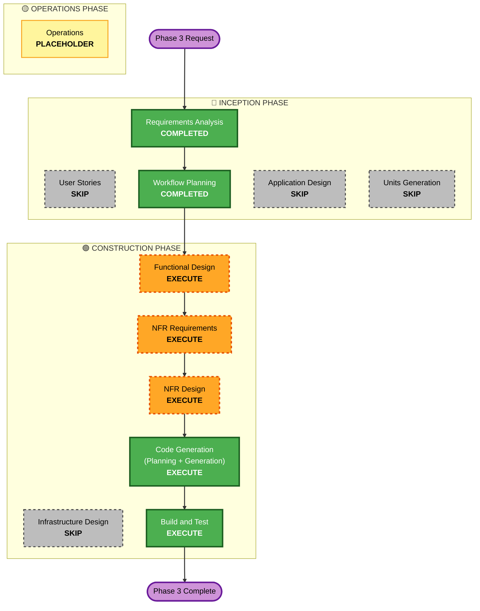

# Execution Plan — Phase 3: Adaptive UI, Dark Theme, Accessibility

One phase at a time. UI-hardening on the existing Compose app; no new
gameplay/data/permissions.

## Detailed Analysis Summary

### Transformation Scope (Brownfield)
- **Type**: Cross-cutting UI enhancement. No infrastructure/data.
- **Primary changes**:
  - Dark color scheme + theme resolution from `Settings.theme`
    (`TesseraTheme(darkTheme=…)`).
  - Move per-screen hardcoded colors onto theme tokens that flip light/dark.
  - Settings screen (Theme control; sound/haptics placeholders).
  - Adaptive layouts via `WindowSizeClass` (max-width, columns, capped board).
  - Reduced-motion handling.
  - Accessibility pass (semantics, focus, targets, contrast, font-scaling).

### Change Impact Assessment
- **User-facing**: Yes — dark mode, Settings, tablet layouts, a11y.
- **Structural**: Theme + a small window-size helper centralized; screens
  refactored to theme tokens; no architecture change.
- **Data model**: None (reuses `Settings.theme`).
- **API**: None external.
- **NFR**: Accessibility + reduced-motion; testing.

### Component Relationships
- **Modified**: `ui/theme/Color.kt` (+dark), `Theme.kt` (darkTheme + resolution),
  all `ui/screens/*` (theme tokens, semantics, adaptive), `HomeScreen` (gear →
  Settings), `MainActivity`/`TesseraApp` (collect theme).
- **New**: `ui/screens/SettingsScreen.kt`, `ui/theme/WindowSize.kt` (or use
  material3 window-size), `domain/model/ThemeResolver.kt` (pure), maybe
  `presentation/SettingsViewModel`.
- **Reused**: `SettingsRepository` (DataStore theme), everything else.

### Risk Assessment
- **Risk**: Low-Medium — broad but mechanical (theming touches many files);
  main risk is missed hardcoded colors breaking dark mode. Mitigated by a
  token audit + light/dark UI checks.
- **Rollback**: Easy (git).
- **Testing**: Pure theme-resolution PBT + light/dark Compose checks + manual.

## Workflow Visualization

## Phases to Execute

### 🔵 INCEPTION PHASE
- [x] Requirements Analysis (COMPLETED)
- [x] User Stories (SKIPPED — UI hardening, clear requirements)
- [x] Workflow Planning (IN PROGRESS)
- [ ] Application Design — **SKIP** (no new service components; theming/Settings
  captured by Functional Design).
- [ ] Units Generation — **SKIP** (single cohesive unit).

### 🟢 CONSTRUCTION PHASE
- [ ] Functional Design — **EXECUTE** (pure ThemeResolver logic + dark palette
  tokens + adaptive rules + Settings behavior; PBT-01 for theme resolution).
- [ ] NFR Requirements — **EXECUTE** (accessibility criteria, window-size lib,
  Compose UI test deps; mostly settled).
- [ ] NFR Design — **EXECUTE** (accessibility patterns, adaptive layout patterns,
  reduced-motion pattern).
- [ ] Infrastructure Design — **SKIP** (offline, no cloud).
- [ ] Code Generation — **EXECUTE**.
- [ ] Build and Test — **EXECUTE**.

### 🟡 OPERATIONS PHASE
- [ ] Operations — PLACEHOLDER.

## Package Change Sequence (Brownfield)
1. `domain/model/ThemeResolver.kt` (pure: SYSTEM/LIGHT/DARK + system-dark →
   effective dark) + PBT.
2. `ui/theme` — dark color scheme + `TesseraColors` light/dark accessors +
   `TesseraTheme(darkTheme)`; window-size helper.
3. Theme wiring — `TesseraApp`/`MainActivity` collect `Settings.theme` +
   system dark → `TesseraTheme`.
4. Screens — migrate hardcoded colors to theme tokens; adaptive layouts + capped
   board; reduced-motion; accessibility semantics/targets/focus.
5. `SettingsScreen` + `SettingsViewModel`; Home gear → Settings.
6. Tests — ThemeResolver PBT; light/dark Compose UI checks.

## Estimated Timeline
- 5 executing stages; 1–2 sessions.

## Success Criteria
- **Primary**: All screens correct in light + dark; Settings theme toggle works;
  adaptive on tablet; reduced-motion honored; accessibility pass done.
- **Deliverables**: dark theme + resolver (+PBT); Settings screen; adaptive
  layouts + capped board; a11y semantics/targets/contrast/font-scaling; Compose
  UI checks; lint clean; app builds.
- **Quality Gates**: build + tests green; lint 0 errors; no hardcoded light-only
  colors remain (audit); TalkBack sweep documented (manual).
