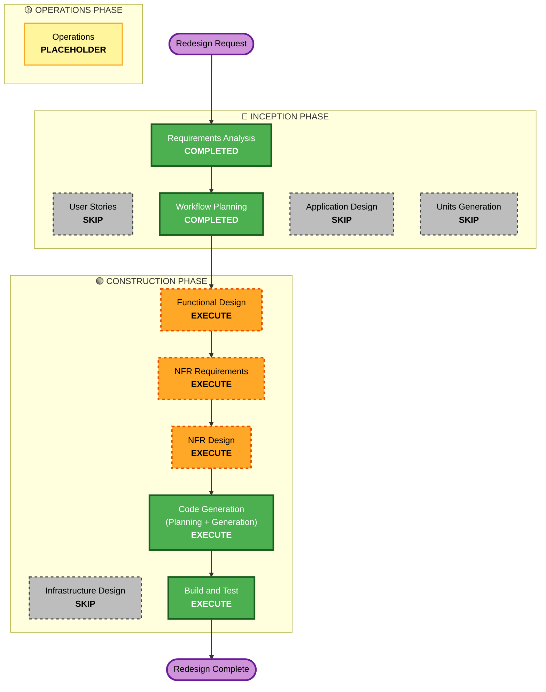

# Execution Plan — Phase 3.5: v2 Visual Redesign

One phase; full reskin on the existing app. No gameplay/data/permission changes.

## Detailed Analysis Summary

### Transformation Scope (Brownfield)
- **Type**: Cross-cutting visual redesign. No infrastructure/data.
- **Primary changes**:
  - Replace theme tokens with v2 light + dark palettes; **Nunito** font.
  - New rounded/shadowed primitives (PillButton, RoundedCard, Chip, Hero) +
    per-level accent tokens; extend `LocalTesseraColors` scheme with v2 values,
    radii, shadow, and per-level accent.
  - **Left settings drawer** replacing the Settings screen/route.
  - Restyle every screen to v2.
  - v2 motion (bob/pulse/rise), reduced-motion gated.
  - Remove unused v1 Barlow fonts + blueprint registration-mark primitives.

### Change Impact Assessment
- **User-facing**: Yes — whole look changes; Settings becomes a drawer.
- **Structural**: Theme system extended (more tokens); primitives replaced;
  Settings nav → drawer. No architecture change.
- **Data model**: None.
- **NFR**: Accessibility must be re-verified on new palettes; reduced-motion.

### Component Relationships
- **Modified**: `ui/theme/Color.kt` (v2 scheme + tokens), `Theme.kt`,
  `Primitives.kt` (new shapes), `Type.kt` (Nunito), all `ui/screens/*`,
  `TesseraApp.kt` (drawer replaces Settings route), `HomeScreen` (drawer trigger).
- **New**: v2 primitives, drawer composable, per-level accent mapping (pure),
  `res/font` Nunito.
- **Removed**: Barlow fonts, `RegistrationFrame`-style blueprint bits (once
  unused).
- **Reused**: architecture, ViewModels, gameplay, persistence, ThemeResolver,
  WindowSize, Motion, reduced-motion.

### Risk Assessment
- **Risk**: Medium — broad UI churn; main risks are (a) missed literal colors,
  (b) contrast regressions on the warm palette, (c) breaking the theme accessor
  contract. Mitigated by keeping the semantic-token pattern, a color audit, and
  light/dark + a11y checks.
- **Rollback**: Easy (git).
- **Testing**: Existing PBT/unit unaffected; add per-level-accent pure test;
  manual visual/a11y sweep.

## Workflow Visualization

## Phases to Execute

### 🔵 INCEPTION
- [x] Requirements Analysis (COMPLETED)
- [x] User Stories (SKIP — visual reskin, clear requirements)
- [x] Workflow Planning (IN PROGRESS)
- [ ] Application Design — **SKIP** (no new services; primitives/drawer captured by FD).
- [ ] Units Generation — **SKIP** (single cohesive unit).

### 🟢 CONSTRUCTION
- [ ] Functional Design — **EXECUTE** (v2 token scheme incl. radii/shadow/per-level;
  drawer behavior; pure per-level accent mapping + PBT-01).
- [ ] NFR Requirements — **EXECUTE** (Nunito, accessibility/contrast criteria; light).
- [ ] NFR Design — **EXECUTE** (theming single-source, primitive patterns, drawer,
  contrast, motion patterns).
- [ ] Infrastructure Design — **SKIP** (offline).
- [ ] Code Generation — **EXECUTE**.
- [ ] Build and Test — **EXECUTE**.

### 🟡 OPERATIONS
- [ ] Operations — PLACEHOLDER.

## Package Change Sequence (Brownfield)
1. `res/font` Nunito; `domain` per-level accent mapping (pure) + PBT.
2. `ui/theme` Color (v2 light+dark scheme + tokens), Type (Nunito), Theme,
   Primitives (Pill/Card/Chip/Hero rounded+shadow).
3. Screens — restyle each to v2 primitives/tokens; per-level accents; motion
   (reduced-motion gated).
4. Settings drawer replacing the Settings screen/route; Home trigger.
5. Remove unused v1 Barlow + blueprint primitives.
6. Tests — per-level PBT; build + existing suite + lint; manual sweep.

## Estimated Timeline
- 5 executing stages; 1–2 sessions (broad but mechanical).

## Success Criteria
- **Primary**: Every screen matches v2 in light + dark; settings drawer works;
  per-level colors applied; motion gated; accessibility preserved.
- **Deliverables**: v2 theme + primitives; drawer; reskinned screens; Nunito;
  per-level PBT; existing tests still pass; lint 0 errors; v1 cruft removed.
- **Quality Gates**: build + tests green; lint clean; no hardcoded off-theme
  colors; AA contrast verified; a11y semantics intact.
