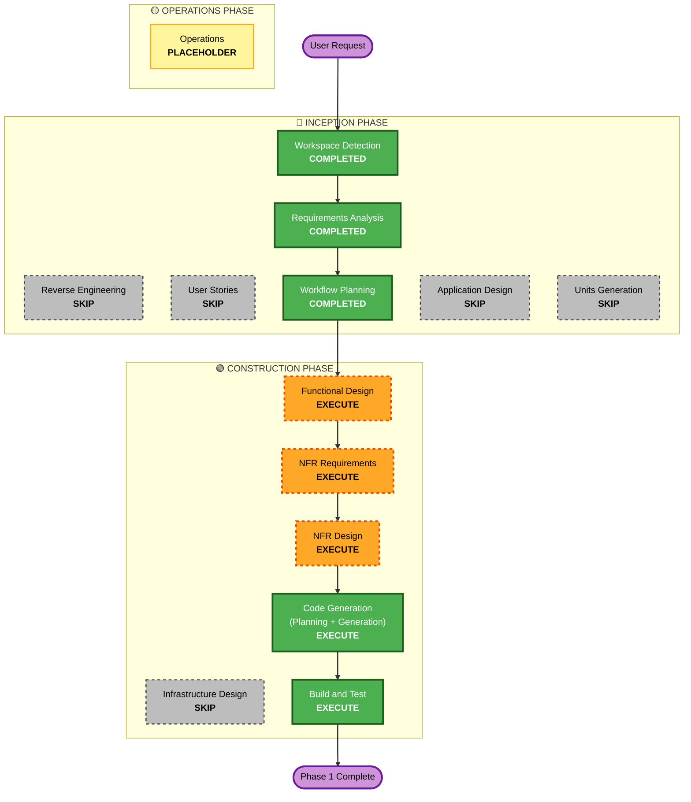

# Execution Plan — Phase 1: Architecture Hardening + Room Persistence

This plan covers **only Phase 1** (per Q4=B, one phase at a time). Phases 2–6
each get their own AI-DLC cycle.

## Detailed Analysis Summary

### Transformation Scope (Brownfield)
- **Transformation Type**: Architectural (introduce layered architecture + DI +
  persistence into the existing single-module slice). No infrastructure/cloud.
- **Primary Changes**:
  - Introduce **Hilt** DI.
  - Restructure `:app` into layered packages: `domain/ data/ presentation/
    image/ ui/ di/` (move the pure engine into `domain`).
  - Add **Room** (entities, DAOs, DB) + **repository** interfaces/impls.
  - Add **DataStore** settings repository (storage only this phase).
  - Migrate `GameViewModel` → `@HiltViewModel` exposing **StateFlow** UI state.
  - Persist in-progress board + best time/moves + completion; **survive restart /
    process death**. Seed the 9 bundled puzzles as Room rows.
  - Add **Kotest Property Testing** and engine/persistence property tests.

### Change Impact Assessment
- **User-facing changes**: Minimal but real — Continue card and stats now
  survive restart (previously reset). No new screens this phase.
- **Structural changes**: Yes — new architecture layers + DI + persistence.
- **Data model changes**: Yes — new Room schema (PuzzleEntity, best-score/stats,
  in-progress board), domain↔entity mapping.
- **API changes**: Internal only — repository interfaces; no network APIs.
- **NFR impact**: Yes — Security (input validation, no PII logging, deps
  pinning), Resiliency (survive process death, corrupt-save handling),
  Performance (DB off main thread), Testing (PBT).

### Component Relationships (Brownfield)
- **Primary Components**: `game/GameViewModel`, `model/*` (→ `domain/`),
  `data/PuzzleCatalog`.
- **New Components**: `data/db` (Room), `data/repository`, `data/settings`
  (DataStore), `di` (Hilt modules), `domain/repository` (interfaces),
  `domain/usecase` (optional).
- **Dependent Components**: all `ui/screens/*` that read `GameViewModel` state
  (Home, Board, Complete) — adapt to StateFlow.
- **Supporting Components**: build config (Hilt/Room/Kotest deps, KSP), tests.

### Risk Assessment
- **Risk Level**: Medium — architectural refactor of working code + new
  persistence; well-understood, incremental, fully test-backed.
- **Rollback Complexity**: Easy — git; each task commits independently.
- **Testing Complexity**: Moderate — JVM unit + PBT for engine/mapping; Room
  tests via in-memory DB (Robolectric or instrumented — decided in Functional
  Design).

## Workflow Visualization

## Phases to Execute

### 🔵 INCEPTION PHASE
- [x] Workspace Detection (COMPLETED)
- [x] Reverse Engineering (SKIPPED — code authored this session; inventory in aidlc-state.md)
- [x] Requirements Analysis (COMPLETED)
- [x] User Stories (SKIPPED — user declined; technical architecture/persistence phase, product behavior already specified)
- [x] Execution Plan / Workflow Planning (IN PROGRESS)
- [ ] Application Design — **SKIP**
  - **Rationale**: No new *service* components with complex business rules; the
    domain engine already exists. New structures (Room entities, repositories)
    are data/schema, covered better by Functional Design. Revisit in Phase 2
    (camera/image services).
- [ ] Units Generation — **SKIP**
  - **Rationale**: Phase 1 is a single cohesive unit of work (one module,
    coordinated refactor). No decomposition into parallel units needed.

### 🟢 CONSTRUCTION PHASE
- [ ] Functional Design — **EXECUTE**
  - **Rationale**: New data models/schemas (Room entities, domain↔entity
    mapping, in-progress board persistence) and business rules (best-score =
    lowest time; bundled-puzzle seeding) need design. **PBT-01** property
    identification is mandatory here.
- [ ] NFR Requirements — **EXECUTE**
  - **Rationale**: Tech-stack selections (Hilt, Room, KSP, DataStore, **Kotest**
    per PBT-09) and Security/Resiliency/Performance requirements for this phase
    must be captured.
- [ ] NFR Design — **EXECUTE**
  - **Rationale**: Design how the NFRs are met (threading model for DB/IO,
    process-death survival, no-PII logging, dependency pinning/lockfile,
    fail-safe error handling/resource cleanup).
- [ ] Infrastructure Design — **SKIP**
  - **Rationale**: No cloud/deployment infrastructure — offline on-device app.
- [ ] Code Generation — **EXECUTE (ALWAYS)**
  - **Rationale**: Implement the architecture + persistence + tests.
- [ ] Build and Test — **EXECUTE (ALWAYS)**
  - **Rationale**: Build, run unit + PBT, verify restart-survival behavior.

### 🟡 OPERATIONS PHASE
- [ ] Operations — PLACEHOLDER

## Reuse vs. Add (confirmed with user)

**Reused as-is (Kotlin — nothing discarded):**
- Puzzle engine `model/*` (Difficulty, Puzzle, Scramble, BoardState) + 10 tests —
  *moved* to `domain/` (package rename, same code).
- All 6 screens (Splash, Home, Difficulty, PuzzleSelect, Board, Complete) — kept;
  only Home/Board/Complete adapt to StateFlow reads.
- Design system: Color, Type, Theme, Primitives, fonts, 9 bundled photos.
- Data helpers: PuzzleCatalog, ImageSlicer.
- Build scaffolding: version catalog, wrapper, JDK-21 pin, assembleDebug.

**Added this phase (additive Jetpack libraries per approved spec):**
- Room (persistence), Hilt (DI), StateFlow (UDF), DataStore (settings),
  Kotest (property-based testing).

## Package Change Sequence (Brownfield)
1. Build config — add Hilt/Room/KSP/DataStore/Kotest to version catalog + app module.
2. `domain/` — move engine (`model/*`), define repository interfaces + domain models.
3. `data/db` — Room entities, DAOs, database; `data/repository` impls; `data/settings` DataStore.
4. `di/` — Hilt modules binding DAOs → repositories.
5. `presentation/` — migrate `GameViewModel` to `@HiltViewModel` + StateFlow; consume repositories.
6. `ui/screens/*` — adapt Home/Board/Complete to StateFlow state; wire persistence.
7. Tests — PBT (engine + mapping) + Room repository tests + restart-survival.

## Estimated Timeline
- **Total Phases (this cycle)**: 5 executing stages (FD, NFR-R, NFR-D, CG, BT).
- **Estimated Duration**: 1–2 focused working sessions.

## Success Criteria
- **Primary Goal**: Production layered architecture (Hilt + repositories +
  StateFlow) with durable Room persistence, no behavior regressions.
- **Key Deliverables**: Room schema + repositories; migrated ViewModel;
  bundled-puzzle seeding; Continue/stats/best-time survive restart; Kotest PBT +
  Room tests passing; app builds.
- **Quality Gates**:
  - All existing + new unit/PBT tests pass; app `assembleDebug` succeeds.
  - Security compliance summary (relevant rules compliant; cloud rules N/A).
  - PBT compliance summary (engine + mapping properties covered).
  - No PII/photo logging; DB/IO off main thread; resources released on error.
