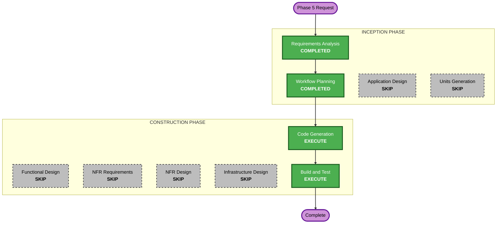

# Phase 5 (Release & Hardening) — Execution Plan

## Detailed Analysis Summary

### Transformation Scope (Brownfield)
- **Transformation Type**: Configuration + hardening (no architectural change).
- **Primary Changes**: Gradle release build config (signing, AAB, version),
  OWASP dependency-check plugin, release-safe logging, `.gitignore` for signing
  material. No source-logic changes beyond guarding/removing log statements.
- **Related Components**: `app/build.gradle.kts`, `gradle/libs.versions.toml`,
  root `build.gradle.kts` (plugin), `.gitignore`, a new `keystore.properties`
  (gitignored, user-supplied), 5 existing log call sites.

### Change Impact Assessment
- **User-facing changes**: No (release build behaves identically; the user
  verifies on-device).
- **Structural changes**: No.
- **Data model changes**: No.
- **API changes**: No.
- **NFR impact**: Yes — security (signing, secrets hygiene, supply-chain scan),
  release hardening.

### Component Relationships
- **Primary Component**: `:app` Gradle module (build config).
- **Shared Components**: version catalog (`libs.versions.toml`).
- **Dependent Components**: none (build-only).
- **Supporting Components**: `.gitignore`, docs (keystore procedure).

### Risk Assessment
- **Risk Level**: Low–Medium. Signing misconfig is the main risk; mitigated by
  a fail-clear config and no R8 (removing the largest runtime-break risk).
- **Rollback Complexity**: Easy (revert build-config commits; no data/schema).
- **Testing Complexity**: Simple (build gates + on-device smoke test).

## Workflow Visualization

## Phases to Execute

### INCEPTION PHASE
- [x] Requirements Analysis (COMPLETED)
- [x] Workflow Planning (IN PROGRESS → COMPLETED on approval)
- [ ] Application Design — **SKIP**
  - **Rationale**: No new components, methods, or service layers — build config
    only.
- [ ] Units Generation — **SKIP**
  - **Rationale**: Single cohesive change to one module; no decomposition.

### CONSTRUCTION PHASE
- [ ] Functional Design — **SKIP**
  - **Rationale**: No new data models or business logic.
- [ ] NFR Requirements — **SKIP**
  - **Rationale**: NFRs already captured in requirements.md + enforced via the
    Security/Resiliency Baseline extensions; no separate NFR elicitation needed.
- [ ] NFR Design — **SKIP**
  - **Rationale**: The "NFR design" here is the release/signing config itself,
    produced in Code Generation; no distinct pattern-design artifact adds value.
- [ ] Infrastructure Design — **SKIP**
  - **Rationale**: No cloud/deployment infrastructure (offline app).
- [ ] Code Generation — **EXECUTE**
  - **Rationale**: Gradle signing/AAB/version config, OWASP plugin wiring,
    release-safe logging edits, `.gitignore` updates, keystore procedure doc.
- [ ] Build and Test — **EXECUTE**
  - **Rationale**: Verify `bundleRelease` (with a throwaway test keystore),
    `dependencyCheckAnalyze`, unit tests, lint; document on-device smoke test.

### OPERATIONS PHASE
- [ ] Operations — PLACEHOLDER

## Estimated Timeline
- **Total executing stages**: 2 (Code Generation, Build and Test).
- **Estimated Duration**: one working session.

## Success Criteria
- **Primary Goal**: A signed Play Store AAB is producible from a user-supplied
  keystore, with hardened, secret-free release config.
- **Key Deliverables**: release `signingConfig` + `bundleRelease`; versionName
  1.0.0; OWASP dependency-check task; release-safe logging; `.gitignore` for
  `*.jks`/`keystore.properties`; keystore-creation procedure doc.
- **Quality Gates**: 53/53 unit tests pass; lint 0 errors; `bundleRelease`
  succeeds with a test keystore; `dependencyCheckAnalyze` runs; no signing
  material committed; user confirms release build runs on-device.
